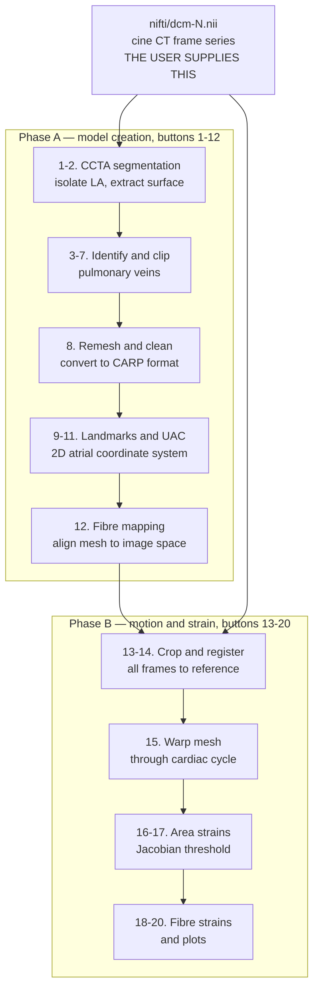
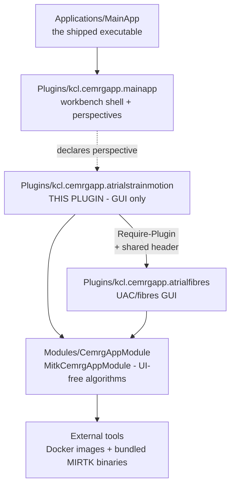

# Atrial Strain Motion — the state of the pipeline

Handover document, 2026-09-04. It describes what
`CemrgApp/Plugins/kcl.cemrgapp.atrialstrainmotion` does today, what runs, what the external tools
are, and what a full run produces.

The companion document is [`proposed-work.md`](proposed-work.md) — what is left to do before this
can merge into `development`.

---

## 1. Summary

`kcl.cemrgapp.atrialstrainmotion` computes **regional strain of the left atrium (LA) from cine
CT**. It takes a time series of cardiac CT frames and produces per-cell area strains and
fibre-direction strains on a fibre-annotated LA surface mesh.

Two workflows that used to be separate are welded into one panel of twenty buttons:

1. **Model creation, buttons 1–12.** Build an anatomically labelled, fibre-annotated LA mesh from
   one reference CT frame. This half is largely a fork of the sibling `kcl.cemrgapp.atrialfibres`
   plugin and runs the **Universal Atrial Coordinates (UAC)** pipeline.
2. **Motion tracking and strain, buttons 13–20.** Register every cine frame to the reference frame,
   warp the mesh through the cardiac cycle, and differentiate the deformation into strain. This half
   is new, and delegates most of the work to the `cemrg/afmotion:1.0` Docker image.

**All twenty steps ran clean, end to end, on one dataset on 2026-09-03.** That is the first
complete run. It is one dataset, and the output checks stay weak — read
[§9](#9-what-one-full-run-produced) and [`proposed-work.md`](proposed-work.md) before trusting
steps 16 or 19 on new data.



**Everything hangs off one project directory** that the user picks once.
Each button reads files off disk, shells out to an external tool, and writes files
back. There is no in-memory pipeline state to speak of. See the directory layout in
[§6](#6-the-project-directory).

---

## 2. Provenance

The plugin is a CemrgApp GUI wrapper around Charles Sillett's PhD pipeline, published as:

> Sillett C, Razeghi O, Lee AWC, Solis Lemus JA, Roney C, Mannina C, de Vere F, Ananthan K,
> Ennis DB, Haberland U, Xu H, Young A, Rinaldi CA, Rajani R, Niederer SA.
> *A three-dimensional left atrial motion estimation from retrospective gated computed tomography:
> application in heart failure patients with atrial fibrillation.*
> **Front Cardiovasc Med** 2024. DOI [10.3389/fcvm.2024.1359715](https://doi.org/10.3389/fcvm.2024.1359715)
>
> Code: <https://github.com/CEMRG-publications/Sillett_2024_FrontiersCardiovascMed>


Two families of material exist outside this repository:

| Where | What |
|---|---|
| The `charlie_pipeline` hand-over bundle | Sillett's scripts, the demo datasets `V-0004` and `V-0005`, the 2024 log files, and `afmotion.tar.gz`. Shared separately with the team. |
| `discovery_report/recovered/` inside that bundle | The `afmotion` image reverse-engineered: `Dockerfile.reconstructed`, `requirements.lock`, the container's whole `/code` payload (33 files) and the `strains.cxx` / `AreaStrain.cxx` sources. |

`recovered/code/` is the authority on what every `afmotion` subcommand does. Read it whenever a
phase-B step behaves oddly — the image has no source in this repository.

---

## 3. Where the code and the artefacts are

| Thing | Location |
|---|---|
| Integration branch | `plugin/atrailstrainmotion` — **the branch name carries a typo and that is the real name**. |
| Open work | [PR #97](https://github.com/OpenHeartDevelopers/CemrgApp/pull/97), branch `plugin/atrialstrainmotion-fix-step-13-crop` — "Unblock step 13 and write the cropped cine frames". Base is `plugin/atrailstrainmotion`. Not yet merged. |
| Merge target | `development`. `plugin/atrailstrainmotion` is 75 commits ahead of it and 0 behind. |
| The motion/strain image | `cemrg/afmotion:1.0` on Docker Hub, public. |


Merged branches that shaped the current code, newest first:

| PR | What it did |
|---|---|
| [#96](https://github.com/OpenHeartDevelopers/CemrgApp/pull/96) | Pinned the openCARP image to `v19-0` and added the PETSc option-file fallback. Unblocked steps 10 and 11. |
| [#95](https://github.com/OpenHeartDevelopers/CemrgApp/pull/95) | Published `cemrg/afmotion:1.0`, made `DockerAtrialStrainMotion` return `bool` with a real output path, restored its logging. |
| [#94](https://github.com/OpenHeartDevelopers/CemrgApp/pull/94) | Ran the Docker containers as the host user with `--user <uid>:<gid>`. |
| [#93](https://github.com/OpenHeartDevelopers/CemrgApp/pull/93) | Moved the `meshtool` calls into the openCARP container. |
| [#92](https://github.com/OpenHeartDevelopers/CemrgApp/pull/92) | Panel usability: the optional-step marking, the Reset button, the clipper Help button. |
| [#91](https://github.com/OpenHeartDevelopers/CemrgApp/pull/91) | Linked `AtrialFibresClipperView` rather than recompiling it, so the view handoff shares one copy of its state. |
| [#89](https://github.com/OpenHeartDevelopers/CemrgApp/pull/89) | Added `CemrgNiftiUtils` and the NIfTI qform repair that step 1 needs. |

---

## 4. Architecture

CemrgApp is a three-layer MITK extension. This plugin sits in the top layer and depends downward
only. It contains **no algorithms** — every non-trivial operation calls into `MitkCemrgAppModule`.



### Registration chain

Five files have to agree for the view to appear in the workbench:

| File | Content |
|---|---|
| `Plugins/PluginList.cmake` | the `kcl.cemrgapp.atrialstrainmotion:ON` entry |
| `manifest_headers.cmake` | `Plugin-Name "AtrialStrainMotion"`, `Plugin-Version "0.1"`, `Require-Plugin org.mitk.gui.qt.common kcl.cemrgapp.atrialfibres` |
| `plugin.xml` | the `org.blueberry.ui.views` extension: id `org.mitk.views.atrialstrainmotionview`, class `AtrialStrainMotionView` |
| `kcl_cemrgapp_atrialstrainmotion_Activator.cpp` | `BERRY_REGISTER_EXTENSION_CLASS(AtrialStrainMotionView, context)`, and the `pluginContext` static that `Reset` needs to reach `mitk::IDataStorageService` |
| `kcl.cemrgapp.mainapp/plugin.xml` | the perspective `kcl.cemrgapp.CemrgAtrialStrainMotionPerspective`, implemented by `QmitkCemrgAtrialStrainMotionPerspective` |

`CMakeLists.txt` declares `MODULE_DEPENDS MitkSegmentation MitkQtWidgetsExt MitkCemrgAppModule` and
`PACKAGE_DEPENDS ITK`. Its `EXPORT_DIRECTIVE ATRIALSTRAINMOTION_EXPORT` is declared but applied to
no class — nothing in this plugin is exported.

### The view class

Everything lives in one class, `AtrialStrainMotionView` — a single ~1,970-line
`src/internal/AtrialStrainMotionView.cpp`, its header, and a flat list of buttons in
`AtrialStrainMotionViewControls.ui`. It derives from `QmitkAbstractView` and overrides three
methods:

- `CreateQtPartControl` builds the UI, wires the twenty pipeline buttons and `Reset` in one run of
  `connect` calls, then calls `SetDefaultPanelState`.
- `SetFocus` focuses button 1.
- `OnSelectionChanged` has an entirely commented-out body. It is a no-op.

There is **no enable/disable state machine, no ordering enforcement and no progress indication**
except inside step 13. Every button is clickable at any time. Pressing them out of order gives
file-not-found errors rather than a helpful message.

**Live member state**, all private:

| Member | Role |
|---|---|
| `directory` | the project root, the pivot for everything |
| `tagName` | the working mesh basename. `CreateQtPartControl` sets `"Labelled"`; `SegmentExtract` sets `"LA_msh"`; `CreateLabelledMesh`, `ClipperPV` and `UacCalculationVerifyLabels` force it back to `"Labelled"` |
| `atrium` | `unique_ptr<CemrgAtrialTools>`, rebuilt by `SetDefaultPanelState` |
| `uiMesh_th/bl/smth/iter` | meshing parameters, always 0.5 / 0 / 10 / 0 |
| `uiLabels`, `uac_whichAtrium` | from the edit-labels and UAC dialogs |

`tagName` is view-wide mutable state that several steps read and three of them write. A check that
runs before the writing step sees the wrong value. Treat it as a hazard when adding any step that
calls `LoadSurfaceChecks`.

Nothing persists across a session except the two `prod*Metadata.txt` files.

### The cross-plugin handoff

Steps 3, 5 and 6 hand off to `AtrialFibresClipperView`, the interactive mesh-clipping view where
the user picks pulmonary-vein ostia and drags clipping spheres. That class belongs to
`kcl.cemrgapp.atrialfibres`. This plugin reaches it through two lines of configuration:

```cmake
# files.cmake
include_directories(../kcl.cemrgapp.atrialfibres/src/internal)

# manifest_headers.cmake
set(Require-Plugin org.mitk.gui.qt.common kcl.cemrgapp.atrialfibres)
```

`include_directories` gives the header. `Require-Plugin` makes `kcl.cemrgapp.atrialfibres` a real
CTK dependency, which puts its shared library on this plugin's link line. `INTERNAL_CPP_FILES`
lists only this plugin's own two `.cpp` files, so the clipper is compiled once, into the plugin
that owns it, and both plugins share one copy of its state.

The handoff itself is three calls, in this order:

1. `this->GetSite()->GetPage()->ResetPerspective();`
2. `AtrialFibresClipperView::SetDirectoryFile(Path("UAC_CT"), <mesh>, <automatic>);`
3. `this->GetSite()->GetPage()->ShowView("org.mitk.views.atrialfibresclipperview");`

`SetDirectoryFile` writes private statics on the clipper class. This works, but a destructor race
can still empty them — see `proposed-work.md`.

---

## 5. The twenty steps

### Phase A — model creation

| # | Button label | Slot | What it runs | Key output |
|---|---|---|---|---|
| 1 | 1. Extract LA Surface Mesh | `SegmentExtract` | `cemrg/ccta` → label arithmetic → MIRTK `extract-surface` | `LA.nii`, `UAC_CT/LA_msh.vtk`, `UAC_CT/LA_msh.nii` |
| 2 | (optional) Post Processing | `SegmentationPostprocessing` | opens MITK's `segmentationutilities` view | — |
| 3 | 3. Identify PVs | `IdentifyPV` | MIRTK `ExecuteSurf`, then opens the clipper view | `UAC_CT/segmentation.vtk`, `UAC_CT_aligned/segmentation.vtk` |
| 4 | 4. Create Labelled Mesh | `CreateLabelledMesh` | `AssignOstiaLabelsToVeins`, `ExecuteSurf`, `ProjectTagsOnExistingSurface` | `UAC_CT/Labelled.vtk` — **the working mesh** |
| 5 | 5. Mesh Preprocessing | `MeshPreprocessing` | reopens the clipper view in automatic mode | `UAC_CT/prodClipperIDsAndRadii.txt` |
| 6 | (optional) Verify Labels | `UacCalculationVerifyLabels` | `CheckLabelConnectivity`, optional `FixSingleLabelConnectivityInSurface` | rewrites `UAC_CT/Labelled.vtk` |
| 7 | 7. Clip PV | `ClipperPV` | `CemrgCommonUtils::ClipWithSphere` per sphere | rewrites `UAC_CT/Labelled.vtk`, writes `pvClipper_<id>.vtk` |
| 8 | 8. Mesh Improvement | `MeshImprovement` | four `meshtool` calls in the openCARP container | `UAC_CT/clean-Labelled-refined.{vtk,pts,elem,lon}` |
| 9 | 9. Auto Landmark | `AutoLandMark` | `afmotion autoLM` | `UAC_CT/prodRefinedLandmarks.txt` |
| 10 | 10. UAC Stage 1 | `UAC_Stage1` | `cemrg/uac` stage 1, then two openCARP Laplace solves | `LSbc*.vtx`, `PAbc*.vtx`, `LR_UAC_N2/phie.igb`, `PA_UAC_N2/phie.igb` |
| 11 | 11. UAC Stage 2 | `UAC_Stage2` | `cemrg/uac` stage 2a, four Laplace solves, then stage 2b | `Labelled_Coords_2D_Rescaling_v3_C.{vtk,pts,elem}` |
| 12 | 12. Create Model | `CreateModel` | `cemrg/uac` fibre mapping, then `afmotion` ×4 | `UAC_CT/clean-Labelled-refined-aligned.vtp` — **the handoff to phase B** |

Step 8's parameters are hardcoded in `MeshImprovement`: `DockerRemeshSurface` with
hmax 0.5, hmin 0.1, havg 0.3, surface correlation 0.95; `DockerCleanMeshQuality` twice, at
thresholds 0.2 and 0.1; `DockerConvertMeshFormat` to `carp_txt` at scale 1000, which turns
millimetres into the micrometres openCARP expects.

Step 12 runs four `afmotion` subcommands in a fixed order, each reading what the one before wrote.
`CreateModel` stops at the first failure:

| Subcommand | Reads | Writes |
|---|---|---|
| `generateLabelledMsh` | `UAC_CT/Labelled_Coords_2D_Rescaling_v3_C.vtk`, `UAC_CT/clean-Labelled-refined.vtk` | saves back onto both inputs |
| `appendFibres` | `clean-Labelled-refined.vtk`, `outputLabelled_{Epi,Endo}.lon` | saves back onto `clean-Labelled-refined.vtk` |
| `rotateSegMsh` | `UAC_CT_aligned/segmentation.vtk` | `UAC_CT_aligned/segmentation-rot.vtk` |
| `alignMesh` | `clean-Labelled-refined.vtk`, `segmentation-rot.vtk`, `UAC_CT/LA_msh.vtk` | `clean-Labelled-refined-aligned.vtk` then `.vtp` |

`UAC_CT_aligned/` therefore is not a dead folder: step 3 fills it and step 12 consumes it. Step 12
also reads `UAC_CT/LA_msh.vtk`, which step 1 wrote — the only late consumer of a phase-A file that
early.

### Phase B — motion tracking and strain

Phase A produces one mesh at one instant. Strain measures *deformation*, so it needs the same mesh
at many instants. The approach is the standard image-registration one: register every frame to the
reference, sample the transformation at each time point, push the mesh's points through it, and
compare each cell against its reference geometry. Because the mesh topology is preserved, cell *i*
at frame 5 is the same piece of tissue as cell *i* at frame 0, so strain is per cell and directly
comparable across the cycle.

| # | Button label | Slot | What it runs | Key output |
|---|---|---|---|---|
| 13 | 13. Crop Images | `CropImage` | `cemrg/ccta` on `dcm-10.nii`, then a host-side crop of every frame | `nifti/dcm-crop-<N>.nii` |
| 14 | 14. registration | `Registration` | `afmotion registration`, then MIRTK `register` | `tracking/imgTimes.lst`, `Final.cfg`, `tsffd.dof` |
| 15 | 15. Deform Mesh | `DeformMesh` | MIRTK `transform-points` ×10 | `tracking/cLr-aligned-<0..9>.vtp` |
| 16 | 16. Generate Cell Area Strains | `GenerateCellAreaStrains` | `afmotion generateCellAreaStrains` | `tracking/area-strains-<0..9>.csv` |
| 17 | 17. jacobianThreshold | `JacobianThreshold` | `afmotion jacobianThreshold` | `tracking/cLr-fibres-aligned-<1..9>-scal_jacob-thr0.2.txt` |
| 18 | 18. plotAreaStrain | `PlotAreaStrain` | `afmotion plotAreaStrain`, global then regional | `tracking/area_strains_regional_excl_PVs_mshqual.png` |
| 19 | 19. Calc Fiber Strains | `CalcFiberStrains` | `afmotion calcFiberStrains` | `tracking/{endo,epi}_avg-strains-t<1..9>.txt` |
| 20 | 20. plot Fiber Strains | `PlotFibersTrains` | `afmotion plotFiberStrains`, global then regional | `tracking/endo_avg_excl_PVs_mshqual_regional.png` |

**Step 13** copies `nifti/dcm-10.nii` to the project root, segments it with `cemrg/ccta`, repairs
the qform, changes labels 8, 9 and 10 to label 4, measures the label with
`itk::LabelStatisticsImageFilter`, pads each axis by `CROP_PADDING_FRACTION` (0.3) of its own
length, clamps the box inside the image, builds a `mitk::Cuboid` from it, and cuts every frame on
disk from 0 to 20 with `CemrgCommonUtils::CropImage`. Each frame is read through a repaired scratch
copy at `<project>/crop-input.nii`, which the step removes afterwards — the pipeline never modifies
the originals under `nifti/`.

Step 13 does **not** use `afmotion cropImages`. That subcommand hardcodes its crop box to another
dataset, consumes its last three arguments as sizes while naming them end indices, and guesses the
sign of the affine shift per axis. `mitk::BoundingObjectCutter` sets the output origin with
`IndexToWorld` on the region start, which is correct for any direction matrix.

**Step 14** is two stages. `afmotion registration` generates `Final.cfg` (a `cat` of a fixed
template) and `imgTimes.lst` (ten hardcoded `echo`s). `CemrgCommandLine::ExecuteTracking` then runs
the bundled MIRTK `register` on them. `imgTimes.lst` holds a **host** path on its first line —
`<project>/nifti/dcm-crop- .nii` — because the host-side MIRTK reads it. That is why
`DockerAtrialStrainMotion` passes the project directory as a positional argument as well as
mounting it. `tsffd.dof` is a temporal sparse free-form deformation: a 4D B-spline lattice that
encodes the whole cardiac cycle in one file.

**Step 15** is the one phase-B step that does real work through an in-repo code path. Each frame is
an independent warp from the same reference mesh, not a chain, which is what preserves topology.
The `-St` time stamps are `frame * 10`.

**Steps 16 to 20** are thin wrappers around one `afmotion` call each.
Area strain measures how much each triangle's area changed, without needing a preferred direction.
Fibre strain (step 19) is the physiologically meaningful measure: atrial myocardium contracts along
its fibre direction, so projecting the deformation onto the local fibre vector isolates active
shortening from passive stretch. That is the payoff that justifies the whole UAC half of the
pipeline. The Jacobian threshold in step 17 is quality control — values far from 1 usually mean
registration failure rather than real motion, and the `0.2` cutoff is baked into the filename
rather than passed as a parameter.

Two naming traps. The C++ slot `PlotFibersTrains` is a typo for "Fibre Strains"; only the string
`plotFiberStrains` passed to Docker matters at runtime. Step 17's output is named
`cLr-fibres-aligned-…` but the container reads `cLr-aligned-<i>.vtp`, step 15's output — the fibre
prefix is a leftover, not a clue to a missing file.

---

## 6. The project directory

The user selects one directory on first use, through `RequestProjectDirectoryFromUser`. Two
constraints are enforced: it must exist, and **its path must contain no spaces**, because external
tools are invoked without shell quoting. The method also redirects the MITK log to
`<project>/afib_log<ISO-date>.log`.

`SegmentExtract` creates `UAC_CT/`, `UAC_CT_aligned/` and `tracking/`. **`nifti/` is not created —
the user must provide it**, populated with the cine CT series as `dcm-<N>.nii`.

```
<project>/
├── nifti/                                   ← THE USER PROVIDES THIS
│   ├── dcm-0.nii … dcm-20.nii                  cine CT frames, one per time point
│   └── dcm-crop-0.nii … dcm-crop-20.nii        step 13 writes these here
│
├── UAC_CT/                                  ← the model-creation working folder
│   ├── prodMetadata.txt                        pipeline selector state, 5 ints
│   ├── prodUacMetadata.txt                     UAC dialog state, 4 ints
│   ├── LA_msh.vtk / LA_msh.nii                 step 1: raw LA surface + rasterised mask
│   ├── prodClean.nii                           steps 3/4: binary segmentation for meshing
│   ├── segmentation.vtk                        steps 3/4: smoothed surface
│   ├── Labelled.vtk                            step 4: THE working mesh, with the elemTag array
│   ├── prodSeedLabels.txt                      clipper: PV labels
│   ├── prodSeedIds.txt                         clipper: matching VTK point IDs
│   ├── prodNaiveSeedLabels.txt                 clipper: pre-correction scalars
│   ├── prodClipperIDsAndRadii.txt              step 5: clipping sphere centres and radii
│   ├── pvClipper_<id>.vtk                      step 7: sphere visualisations
│   ├── Labelled-refined.vtk                    step 8: remeshed
│   ├── clean-Labelled-refined.vtk              step 8: quality-cleaned
│   ├── clean-Labelled-refined.pts/.elem/.lon   step 8: CARP format, coordinates x1000
│   ├── <mesh>.fcon                             step 8: meshtool connectivity cache
│   ├── prodRefinedLandmarks.txt                step 9: UAC anchor landmarks
│   ├── LSbc1.vtx LSbc2.vtx PAbc1.vtx PAbc2.vtx step 10: boundary node sets
│   ├── carpf_laplace_LS.par / _PA.par          step 10: openCARP parameter files
│   ├── LR_UAC_N2/ PA_UAC_N2/                   step 10: openCARP solve output, holds phie.igb
│   ├── AnteriorMesh.pts/.elem                  step 11: anterior sheet
│   ├── PosteriorMesh.pts/.elem                 step 11: posterior sheet
│   ├── {Ant,Post}_Strength_Test_{LS1,PA1}.vtx  step 11: boundary sets
│   ├── carpf_laplace_single_{LR,UD}_{A,P}.par  step 11: four parameter files
│   ├── {LR,UD}_{Post,Ant}_UAC/                 step 11: four openCARP solve output dirs
│   ├── Labelled_Coords_2D_Rescaling_v3_C.*     step 11: final UAC coordinate mesh
│   ├── outputLabelled_{Endo,Epi}.lon           step 12: fibres, plus the _avg.lon copies
│   └── clean-Labelled-refined-aligned.vtk/.vtp step 12: THE handoff to phase B
│
├── UAC_CT_aligned/
│   ├── segmentation.vtk                        step 3 copies it here
│   └── segmentation-rot.vtk                    step 12 afmotion rotateSegMsh
│
├── tracking/
│   ├── imgTimes.lst                            step 14: frame list for MIRTK, holds a HOST path
│   ├── Final.cfg                               step 14: MIRTK registration parameters
│   ├── tsffd.dof                               step 14: temporal free-form deformation
│   ├── cLr-aligned-<0..9>.vtp                  step 15: mesh warped to each frame
│   ├── cLr-aligned-<n>-areas.txt               step 16: per-cell areas
│   ├── area-strains-<n>.csv                    step 16: per-cell area strain
│   ├── cLr-fibres-aligned-<n>-scal_jacob-thr0.2.txt   step 17
│   ├── {endo,epi}_avg-strains-t<n>.txt         step 19: per-cell fibre strain
│   └── *.png                                   steps 18 and 20: the plots
│
├── dcm-<N>.nii                              steps 1 and 13: working copies pulled out of nifti/
├── dcm-<N>_label_maps.nii.gz                steps 1 and 13: CCTA multilabel output
├── crop-input.nii                           step 13: scratch copy, removed after each frame
├── LA.nii                                   step 1: LA-only segmentation, voxel value 4
├── LA_msh.vtk                               step 1: LA surface before the UAC_CT copy
├── Labelled.nii                             step 4: written here rather than in UAC_CT/
└── afib_log<ISO-date>.log                   the MITK log
```

### The input contract, as the code assumes it today

**This is assumed, not enforced, and it is the largest single source of quiet wrongness.**

- Frames are named `dcm-<N>.nii` and live in `nifti/`.
- Both demo datasets hold **21** frames, `dcm-0` to `dcm-20`.
- Step 1 takes `nifti_dir.entryList(QDir::AllEntries | QDir::NoDotAndDotDot).at(0)` — the first
  entry in alphabetical order, directories included. On the demo data that is `dcm-0.nii`, because
  `'0'` is 0x30 and `'c'` is 0x63, so the crops written by step 13 sort after it. That is luck, not
  design.
- Step 13 loops frames 0 to 20 and skips a frame that is absent.
- Step 13 hardcodes `dcm-10.nii` as the frame it measures the atrium on. Nothing records why.
- Steps 15 and 16 loop `frame < 10`. Step 17 loops `frame = 1; frame < 10`. The container hardcodes
  `numTimes=10` and `GenerateLST_20_TDownsampled.sh` names frames 0, 2, 4 … 18.
- **Nothing counts the files in `nifti/`.** On the demo data the pipeline registers ten of the
  twenty-one frames and computes strain over part of the cardiac cycle.

The 1-based start in step 17 is defensible — frame 0 is the reference and its Jacobian is 1 by
definition — but it is not commented, so it reads as an off-by-one.

---

## 7. External tools

The plugin delegates everything through `CemrgCommandLine` to Docker containers or to bundled MIRTK
binaries.

| Tool | Image or location | Used by | Pinned? |
|---|---|---|---|
| CCTA multilabel segmentation | `cemrg/ccta:latest` | steps 1, 13 | tag only |
| UAC and fibre mapping | `cemrg/uac:3.0-beta` | steps 10, 11, 12 | yes |
| openCARP — also supplies `meshtool` | `docker.opencarp.org/opencarp/opencarp:v19-0` | steps 8, 10, 11 | yes |
| **afmotion** | `cemrg/afmotion:1.0` | steps 9, 12, 14, 16–20 | yes |
| MIRTK | `<app dir>/MLib/*` — binaries placed by hand | steps 1, 3, 4, 14, 15 | — |

All four images are public. The tags come from `CemrgCommandLine.h`:
`SetDockerImageOpenCarp(QString opencarp_tag="v19-0")`, `SetDockerImageAfmotion(QString
afmotion_tag="1.0")`, and `SetDockerImageUac("3.0-beta")` inside `DockerUacMainMode` and
`DockerUacFibreMappingMode`. `DockerCctaMultilabelSegmentation` sets `cemrg/ccta:latest` inline.

### The `ExecuteCommand` contract

Nearly every external call funnels through `CemrgCommandLine::ExecuteCommand(exe, args, outputPath,
shouldTouchOutputFirst)`. Success means **the output file exists and is non-empty**
(`IsOutputSuccessful`). The exit status of the process is never read.

`shouldTouchOutputFirst` defaults to `true`, and creates an empty file before the tool runs. It had
two purposes: to keep the file owned by the host user, and to stop a stale file passing as a fresh
success. `GetDockerUserArguments` now supplies `--user <uid>:<gid>`, so the first purpose is gone
for every container the pipeline reaches. **Every Docker touch in this pipeline is removed.** Seven
local MIRTK touches remain, and those still serve the second purpose.

Three inline argument builders elsewhere in the module still gain no `--user` and keep their touch:
`DockerCemrgNetPrediction`, `DockerDicom2Nifti`, and the `igbextract` block inside
`OpenCarpDockerLaplaceSolves`. Each carries a TODO naming the method to call. This pipeline reaches
none of them.

Two quirks worth knowing. `ExecuteTouch` is a no-op on Windows — its whole body sits inside
`#ifdef _WIN32`. And `PrintFullCommand` force-enables debug output and appends every command to
`<app dir>/dockerDebug.txt`, which is the easiest way to reproduce a failing call by hand.

### MIRTK

Not Docker. `CemrgCommandLine` runs `QCoreApplication::applicationDirPath() + "/MLib/<command>"`.

| Method | Binary | Used by |
|---|---|---|
| `ExecuteExtractSurface` | `extract-surface` | step 1 |
| `ExecuteSurf` | `close-image` → `extract-surface` → `smooth-surface` | steps 3, 4 |
| `ExecuteTracking` | `register` | step 14 |
| `ExecuteTransformationOnPoints` | `transform-points` | step 15 |

`ExecuteTracking` returns `void` and only logs on failure, so step 14's real signal — whether
`tsffd.dof` arrived — never reaches the user.

### `cemrg/afmotion:1.0`

Eleven of the twenty steps depend on this image, and **no source for it is in this repository**.

Bei Zhou built it in September 2024 and never published it or committed a Dockerfile. It came back
through `docker save` and was published unchanged as `cemrg/afmotion:1.0` on 2026-09-01. The push
reported the same manifest digest the local image carried, so the published copy is bit-identical
to the build that was verified.

| | |
|---|---|
| Manifest digest | `sha256:6574a5bc4f79bb221ac5bd1c8cd3132abf05b626f4c04c6d444c3c1c64ade70c` |
| Config digest | `sha256:3dfd969def2553ad0ae0c74a576e4b8e2f8c9e4790eaa7df39b83a2ef3b560ce` |
| Created | `2024-09-16T17:07:49.319251843+01:00`, linux/amd64 |
| Size / layers | `7,224,854,415` bytes, 22 layers |
| Entrypoint | `["/opt/venv/bin/python3", "-u", "/code/uac_pipeline.py"]`, `WORKDIR /data` |
| Base | `python:3.9.20`; VTK 9.3 built from source, which is 4.87 GB of the 7.22 |
| C++ tools | `/bins/areastrain-main/build/AreaStrain` and `/bins/strains-main/build/strains` |

Docker reports the *manifest* digest on a host using the containerd image store and the *config*
digest on a host using the classic store. Both are correct for the same image.

The interface is one script with a subcommand and a positional path:

```
docker run --rm --user <uid>:<gid> --volume=<project>/:/data/ \
    cemrg/afmotion:1.0 <subcommand> <project>
```

Both arguments are required: `argparse` exits 2 without the positional path. The path is a **host**
path and that is deliberate — see step 14 above.

| Step | Slot | Subcommand |
|---|---|---|
| 9 | `AutoLandMark` | `autoLM` |
| 12 | `CreateModel` | `generateLabelledMsh`, `appendFibres`, `rotateSegMsh`, `alignMesh` |
| 14 | `Registration` | `registration` |
| 16 | `GenerateCellAreaStrains` | `generateCellAreaStrains` |
| 17 | `JacobianThreshold` | `jacobianThreshold` |
| 18 | `PlotAreaStrain` | `plotAreaStrain` |
| 19 | `CalcFiberStrains` | `calcFiberStrains` |
| 20 | `PlotFibersTrains` | `plotFiberStrains` |

Three subcommands exist and are **not used**: `cropImages` (the box is hardcoded to another
dataset), `deformMesh` and the `register` half of `registration` (both would call a MIRTK that is
not in the image — `MLIB_PATH` in `uac_pipeline.py` points at a path on the original author's
workstation). Do not "fix" that by installing MIRTK in the container. The plugin runs those
natively, and `imgTimes.lst` would then need container paths, which would break the host-side
`register`. `fix_vtk_metadata` is a declared no-op.

**Five limits of the image, all confirmed by reading `recovered/code/`:**

1. **It always exits 0.** `uac_pipeline.py` dispatches every subcommand through `os.system(cmd)` and
   discards the return value — seventeen times, with no error handling anywhere in the file. An
   accepted subcommand exits 0 however completely it failed inside.
2. **Two subcommands leave a small non-empty file behind on failure.** `generateCellAreaStrains`
   writes 6-byte CSVs holding `,Area`; `calcFiberStrains` writes 52-byte files holding two
   zero-cell header lines. Both pass an exists-and-not-empty check. Three things compose to cause
   it: the shell redirect `>` creates the target before the program runs, the C++ tools print their
   header and return `EXIT_SUCCESS` on an empty mesh, and both loops are `bash` without `set -e`,
   so the highest-numbered file is written even when every frame failed.
3. **Two step-12 subcommands write in place.** `generateLabelledMsh` and `appendFibres` save onto
   their own inputs, so no existence check can tell "ran" from "did nothing".
4. **No check separates fresh output from stale.** Output is host-owned and survives a re-run.
5. **`meshtool` is not installed.** Nothing the plugin calls needs it, but every `meshtool` call in
   `py_atrial_fibres/meshtools_utils.py` would fail silently.

The Python loops in `jacobianThreshold` are fail-fast, so limit 2 does not apply there.

### Not used by this plugin

Easy to mistake for part of this pipeline: `orodrazeghi/cemrgnet`
(`DockerCemrgNetPrediction` — reachable only from dead code here), `orodrazeghi/dicom-converter`
(the plugin assumes `nifti/` already exists; convert elsewhere), `biomedia/mirtk:v1.1.0` (the
`_dockerimage` default in the constructor, which no code path uses), `MeshTools3D`, and
`OpenCarpDockerLaplaceSolves`.

---

## 8. Environment setup for a fresh build

Four things must be placed by hand. None of them is in this repository, and a build without them
fails at step 1, step 8 or step 10 rather than at configure time.

**1. `MLib` — the MIRTK binaries.** `CemrgCommandLine` resolves every MIRTK tool as
`applicationDirPath() + "/MLib"`. CemrgApp does not build MIRTK. Place the folder in
`MITK-build/bin`, the same way `M3DLib` and `EBR_data` are placed. Without it, step 1 writes
`LA.nii` and then fails with `MIRTK libraries not found` and a 0-byte `LA_msh.vtk`.

**2. `libtbb.so.2` for those binaries.** The prebuilt MIRTK binaries link against TBB 2020. Modern
distributions ship `libtbb.so.12` (oneTBB 2021+), which is not ABI compatible, and `libtbb2` has no
installation candidate on recent Ubuntu. The project wiki's advice to install `libtbb-dev` targets
Ubuntu 22.04, where that package still provided `libtbb.so.2`. Checked across every binary,
`libtbb.so.2` is the only missing library, and `M3DLib` is unaffected.

Obtain a TBB 2020 build that provides `libtbb.so.2` — a conda environment or an Ubuntu 22.04
package both work — copy the single library into a folder of your own, and set `LD_LIBRARY_PATH` to
that folder **in the shell that launches CemrgApp**, not just for MIRTK. CemrgApp spawns the tools
as child processes and they inherit the environment. Copy the one library out rather than putting a
whole conda environment on the path, which would shadow `libstdc++`, `libz` and others. An `rpath`
on the binaries alone does not work; the loader must be told.

**3. `petsc_opts` — the PETSc option files.** `GetOpenCarpDockerLaplaceSolverArguments` copies
`amg_cg_opts` and `ilu_cg_opts` from `applicationDirPath() + "/petsc_opts"` into the mount and names
them to openCARP. The copy was added in 2022 and the folder was never committed, so on most machines
it silently did nothing — `QFile::copy` returns `false` into a `MITK_INFO(...)` log gate, which
suppresses the word "Success!" while the preceding lines still print.

That mattered, because when openCARP is given an options file it cannot read it **segfaults during
solver setup** rather than falling back. The method now names each `-*_options_file` flag only when
the destination file exists, and warns otherwise, so a build without the folder runs on openCARP's
own defaults. Those defaults are token-for-token identical to `amg_cg_opts` for these Laplace
solves, so the numerical result is the same. Place the folder in `MITK-build/bin` anyway, to use the
project's settings and to silence the warning.

Packaging is settled: a release packages `petsc_opts` alongside `MLib` and `M3DLib`.

**4. The Docker images.** `cemrg/ccta:latest`, `cemrg/uac:3.0-beta` and `cemrg/afmotion:1.0` pull
from Docker Hub on first use. openCARP runs its own registry:

```
docker pull docker.opencarp.org/opencarp/opencarp:v19-0
```

Use `v19-0`, not `latest`. `latest` is a development build and rejects the `ellip_use_pt` and
`parab_use_pt` parameters that `OpenCarpParamFileGenerator` writes, so openCARP exits in the
parameter parser before PETSc ever starts. Note the tag uses a dash where the matching git tag uses
a dot.

---

## 9. What one full run produced

Verified in the GUI on 2026-09-03, on the `V-0004` demo dataset, working from a copy of it.

**Step 13** repaired the header of the segmentation, measured the atrium and wrote all 21 cropped
frames in 113 seconds.

| | |
|---|---|
| Atrium bounding box | `7 306 98 255 73 249` |
| Padded box | `0 395 51 302 21 268` |
| Cropped frame | 396 × 252 × 248, 49,497,184 bytes, from 141 MB |
| Voxels | 24.7 M against 70.5 M — 35%, so step 14 sees 2.85 times fewer |

The geometry is exact: `qform_code=1`, worst orthonormality error 0.0, and the cropped origin
equals the original origin plus `M · start` to the last digit the header holds.

**Step 14** ran MIRTK `register` on the cropped frames for 63 seconds and wrote `tracking/tsffd.dof`
at 9,039,844 bytes. `imgTimes.lst` named frames 0, 2, 4 … 18, all of which existed.

**Steps 15 to 20** followed in the same session. Every per-frame output holds different content,
checked by `md5sum`, so no step repeated one result or wrote an empty one: 10 distinct warped
meshes, 10 area-strain CSVs, 9 Jacobian files, 9 endo strain files, and six plots.

**Reference output sizes. Keep these — they are what makes a size floor a concrete change rather
than a guess.**

| Step | File | Real size |
|---|---|---|
| 15 | `cLr-aligned-<0..9>.vtp` | 19.24 MB |
| 16 | `area-strains-<0..9>.csv` | 6.45 to 6.72 MB |
| 17 | `cLr-fibres-aligned-<1..9>-scal_jacob-thr0.2.txt` | 6,091,625 B, every frame |
| 19 | `{endo,epi}_avg-strains-t<1..9>.txt` | 7.71 to 7.90 MB |

Real outputs and the failure artefacts described in [§7](#cemrgafmotion10) are five orders of
magnitude apart. A floor of 1 MB clears every real output by a factor of six and every failure
artefact by four orders of magnitude. Step 17's nine files share one byte count because the format
is fixed width; their checksums all differ, so the content is per frame.

**One observation worth acting on.** The atrium bounding box starts at x = 7, which is 3 mm from
the edge of a 512-voxel volume. A left atrium with its veins does not reach the chest wall, so
label 4 probably holds stray voxels far from the atrium. The padding then clamps x to the full
width and the x axis is barely cropped, 396 of 512. A largest-connected-component filter on label 4
before the bounding box would tighten it and protect it from a single stray voxel.
`CemrgAtrialTools` already uses `itk::ConnectedComponentImageFilter` and
`itk::RelabelComponentImageFilter` for this kind of work. It was not done because it changes what
the step measures, and the current box is correct, just generous.

---

## 10. Failures already found and fixed

Four failures were hit by running the pipeline on real data. Each explains a piece of live code, so
they are kept.

### The NIfTI qform, steps 1 and 13

Both demo datasets carry `qform_code = 0` on all 21 frames, with a well-formed sform, and the
`cemrg/ccta` container rebuilds its output header from the image affine, so its output inherits the
same property. ITK refuses to read such a file:

```
ITK ERROR: ITK only supports orthonormal direction cosines. No orthonormal definition found!
```

`CemrgNiftiUtils::RepairNiftiQform` enables the qform by copying `sform_code` into `qform_code` — a
two-byte patch — but **only** after checking that the stored quaternion reproduces the sform to
tolerance. Otherwise it reports `CannotRepair` rather than silently giving the file a geometry it
never claimed. `InspectNiftiQform` is the non-mutating half.

**The mechanism is not the one the code comments describe, and the next person should not repeat
it.** `CemrgNiftiUtils.h` says ITK "determines image direction from the qform alone". The built ITK
prefers the sform when the qform is unset, but only inside `if (sform_decomposable_without_skew)`.
That flag falls to `IsAffine(sto_xyz)`, which compares a single-precision 4×4 SVD inverse against
the 3×3 inverse, and is ill-conditioned for a 755 mm z offset. So the sform is rejected as not
decomposable, ITK falls through to the qform, the qform is unset, and it throws. The repair is
right; the reason usually given for it is wrong.

The fix was first added only at the call site that had failed. `CropImage` hit the identical error
a fortnight later. **Both call sites that load container output now repair first.**

**The pipeline repairs only files it created itself.** The originals under `nifti/` are never
touched. That decision is why step 13 reads every frame through a scratch copy. It costs about 3 GB
of extra I/O across 21 frames of 141 MB; `RepairNiftiQform` on an uncompressed `.nii` is a two-byte
in-place patch, so the copy is the price of the rule, not of the repair.

### `tagName` read before it is written, step 1

A **second** run of step 1 on a finished project warned that `UAC_CT/Labelled.vtk` was missing.
Nothing in step 1 writes a file by that name. The path is built from `tagName`, which
`CreateQtPartControl` initialises to `"Labelled"`. `SegmentExtract` sets it to `"LA_msh"`, but only
near the end — after `GetUserAnalysisSelectorInputs` has already called `LoadSurfaceChecks()`
against the default. Only a second run reached that call, because it sits behind
`if (QFile::exists(metadata))`.

### openCARP, steps 10 and 11

Step 10 failed for **three** independent reasons, stacked so that each hid the next.

| | Defect | Effect | Fix |
|---|---|---|---|
| 1 | `:latest` rejects `ellip_use_pt` and `parab_use_pt` | openCARP exits in the parameter parser | pin `SetDockerImageOpenCarp` to `v19-0` |
| 2 | the `petsc_opts` folder is absent beside the binary | PETSc segfaults during solver setup | name each `-*_options_file` flag only when the file exists, and place the folder in `MITK-build/bin` |
| 3 | `OpenCarpDocker` checked the output *directory* it had just created | both failures reported as success | name `phie.igb`, and check it in the view |

Three hand-runs isolated them. With `v19-0` and no option files present, openCARP segfaults and
leaves one 0-byte `parameters.par` — and prints no parameter-parser error, which is what proved
defect 1 fixed and defect 2 separate. With the two `-*_options_file` flags dropped it solves happily
on its own defaults in 0.86 s and writes a 490,024-byte `phie.igb`. With the real option files in
place it writes a `phie.igb` of exactly the same size, because `amg_cg_opts` is token-for-token
identical to those defaults. Supplying the file changes nothing numerically. It only stops openCARP
dying on an unreadable one.

### Output checks that could not see a failure, steps 9 to 20

`DockerAtrialStrainMotion` used to return `void`, pass `""` as the output path, and carry its
success logging commented out. It built its `docker run` list inline and never got
`GetDockerUserArguments`, so the container wrote as root — which is why the view pre-created every
expected output with `ExecuteTouch`, and why step 9 reported `Final decision: Done` on a run that
did nothing. Every `prodRefinedLandmarks.txt` a plugin run produced was 0 bytes.

All of that is closed. The method now runs the container as the host user, takes the path of the
file the subcommand writes, returns whether that file arrived, and logs. All nine explicit
`ExecuteTouch` calls in the view are gone, and
`AtrialStrainMotionView::RunAndCheckDockerAtrialStrainMotionSubcommand` names the failing subcommand
and the missing file in a dialogue.

**The path argument was never wrong.** An earlier diagnosis proposed passing `/data` instead of the
host path. Do not do that — see step 14 in [§5](#phase-b--motion-tracking-and-strain).

What remains is described in [`proposed-work.md`](proposed-work.md): the existence check still
cannot see the three cases in [§7](#cemrgafmotion10).

---

## 11. Conventions used in this document

- **Every factual claim cites source by name, never by line number** — a function, class, member,
  slot, CMake variable, or a quoted fragment of the code. So `SegmentExtract()`, or "the
  `ReplaceLabel` calls in `SegmentExtract`", rather than a line range. This is deliberate: these
  notes were first written with `file:line` citations throughout, and a single bugfix branch shifted
  `AtrialStrainMotionView.cpp` by about 100 lines and invalidated most of them at once. Names
  survive edits, and they are greppable.
- Unqualified symbol names belong to `AtrialStrainMotionView` unless another class is named. Methods
  of other classes are written `CemrgCommandLine::ExecuteSurf`.
- Paths are relative to the user's chosen project directory unless stated otherwise, so
  `UAC_CT/Labelled.vtk` means `<project>/UAC_CT/Labelled.vtk`.
- Where a data contract is *inferred* rather than read out of source, that is stated explicitly.
